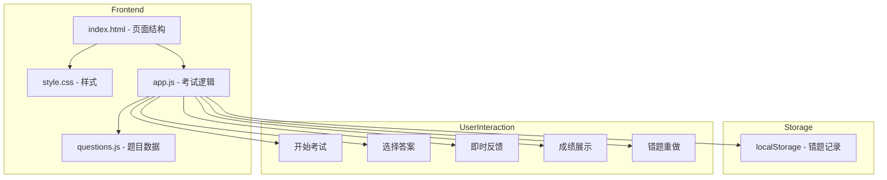

# 药物分析考试平台 技术架构文档

## 1. Architecture Design



## 2. Technology Description

- 前端：纯 HTML5 + CSS3 + JavaScript (ES6+)
- 数据存储：localStorage (浏览器本地存储)
- 特点：无需后端服务器，单页面应用，数据持久化到浏览器

## 3. 题目数据结构

```javascript
// 题目数据格式
const questions = [
  {
    id: 1,
    type: 'fill',           // fill: 填空题转选择题, truefalse: 判断题
    question: '药物的熔点收载于质量标准的哪一项下？',
    options: ['A. 性状', 'B. 鉴别', 'C. 检查', 'D. 含量测定'],
    answer: 'A',            // 正确答案字母
    explanation: '药物的熔点收载于质量标准的性状项下'
  },
  {
    id: 2,
    type: 'truefalse',
    question: '人用药品注册技术要求国际协调会的英文缩写是ICH',
    options: ['A. 正确', 'B. 错误'],
    answer: 'A',
    explanation: 'ICH是 International Council for Harmonisation 的缩写'
  }
];
```

## 4. 考试状态管理

```javascript
// 考试状态
const examState = {
  currentIndex: 0,         // 当前题目索引
  wrongQuestions: [],      // 错题列表
  correctCount: 0,         // 正确数
  totalQuestions: 0,       // 总题数
  isAnswerCorrect: null,   // 当前题目答案是否正确
  showFeedback: false,     // 是否显示反馈
  selectedAnswer: null     // 用户选择的答案
};
```

## 5. 页面路由逻辑

| 页面 | 显示条件 | 主要功能 |
|------|----------|----------|
| 首页 | 默认 | 开始考试、查看错题统计、进入错题重做 |
| 考试页 | 点击"开始考试" | 逐题作答、即时反馈、导航控制 |
| 结果页 | 考试完成 | 显示成绩、错题列表、错题重做入口 |
| 错题重做页 | 点击"错题重做" | 针对错题的针对性练习 |

## 6. 核心功能实现要点

### 6.1 题目格式转换
- 填空题：从题干中提取关键词生成4个选项，正确答案为原答案
- 判断题：直接转换为"正确/错误"两选项

### 6.2 答题反馈逻辑
1. 用户选择选项 -> 点击"下一题"
2. 验证答案是否正确
3. 正确：直接跳转到下一题
4. 错误：
   - 错误选项背景变红
   - 正确选项背景变绿
   - 记录该题为错题
   - 用户必须重新选择正确答案才能继续
   - 重新选择正确答案后，显示正确反馈并允许继续

### 6.3 错题记录
- 使用 localStorage 持久化存储错题
- 错题重做模式只从错题池中抽取题目
- 答对的错题可以从错题池中移除（可选功能）

## 7. 文件结构

```
fuxi/
├── index.html          # 主页面
├── style.css           # 样式文件
├── app.js              # 核心逻辑
├── questions.js        # 题目数据
└── .trae/documents/
    ├── prd.md          # PRD文档
    └── architecture.md # 技术架构文档
```
