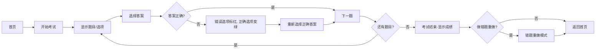

# 药物分析考试平台 PRD

## 1. Product Overview
一个基于Web的药物分析知识记忆与考试练习平台，帮助用户通过做题强化记忆，自动记录错题并支持错题重做。

## 2. Core Features

### 2.1 User Roles
| Role | Registration Method | Core Permissions |
|------|---------------------|------------------|
| 普通用户 | 无需登录 | 浏览题库、进行考试练习、查看错题、做错题重做 |

### 2.2 Feature Module
1. **首页**: 展示考试入口、错题重做入口、考试进度统计
2. **考试页面**: 题目展示、选项选择、答案反馈、下一题导航
3. **结果页面**: 考试成绩展示、错题列表、错题重做入口
4. **错题重做页面**: 针对错题的针对性练习

### 2.3 Page Details
| Page Name | Module Name | Feature description |
|-----------|-------------|---------------------|
| 首页 | 考试入口模块 | 点击开始考试，进入做题流程，显示总题数 |
| 首页 | 错题统计模块 | 显示当前错题数量，支持点击进入错题重做 |
| 考试页面 | 题目展示区 | 显示当前题号、题目内容、题型标识 |
| 考试页面 | 选项交互区 | 显示A-D选项，点击选择，支持即时反馈 |
| 考试页面 | 答案反馈区 | 错误选项标红，正确答案标绿，提示重新选择 |
| 考试页面 | 导航控制区 | 下一题按钮，答题正确可直接跳转 |
| 结果页面 | 成绩展示区 | 显示正确率、答对题数、错题数 |
| 结果页面 | 错题列表区 | 展示本次考试所有错题及正确答案 |
| 结果页面 | 错题重做入口 | 点击进入错题重做模式 |
| 错题重做页面 | 错题练习区 | 针对错题的练习，清除已掌握的错题 |

## 3. Core Process
用户进入首页 -> 点击开始考试 -> 逐题做答 -> 选择答案后点击下一题 -> 答案正确直接下一题 -> 答案错误时标红错误选项并显示正确答案（绿色），需重新选择正确答案 -> 考试结束显示成绩和错题 -> 可选择做错题重做 -> 完成错题练习

## 4. User Interface Design

### 4.1 Design Style
- 主色调：医学蓝 (#165DFF) 搭配温暖的辅助色
- 按钮风格：圆角现代按钮，hover时有缩放和阴影效果
- 字体：使用思源宋体/黑体等中文友好字体
- 布局：卡片式布局，清晰的视觉层次
- 动画：平滑的过渡动画，答题反馈有明显的颜色变化

### 4.2 Page Design Overview
| Page Name | Module Name | UI Elements |
|-----------|-------------|-------------|
| 首页 | 考试入口卡片 | 大尺寸圆角卡片，主色调按钮，图标点缀 |
| 首页 | 统计卡片 | 网格布局，数字大字体展示 |
| 考试页面 | 题目区域 | 白底卡片，题号进度条，题目文本清晰可读 |
| 考试页面 | 选项区域 | 大尺寸选项按钮，悬停效果明显 |
| 考试页面 | 反馈状态 | 红色错误状态，绿色正确状态，带图标提示 |
| 结果页面 | 成绩区域 | 大字号分数，环形进度图 |
| 结果页面 | 错题列表 | 可折叠列表，显示题目和正确答案 |

### 4.3 Responsiveness
- Desktop-first 设计
- 移动端自适应，卡片堆叠布局
- 按钮和选项在移动端保持足够的点击区域

### 4.4 Colors
- 主色：#165DFF (医学蓝)
- 正确答案：#00B42A (绿色)
- 错误答案：#F53F3F (红色)
- 背景：#F5F7FA
- 文字：#1D2129
